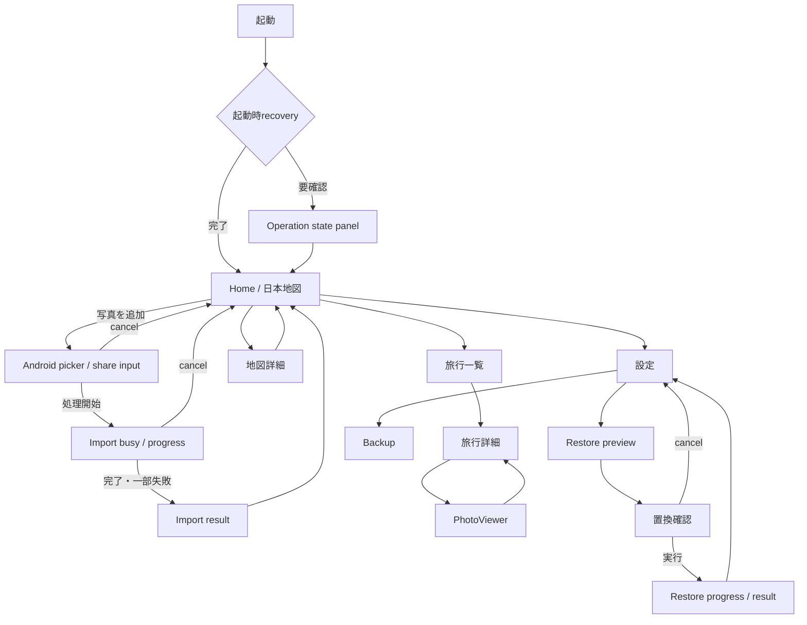

# ここいった UI刷新デザインブリーフ

- Issue: #83
- Parent Epic: #41
- Base branch: `main`
- Audited baseline: `1fde5f5c63179941bad006bc5e75a58c5341a187`
- Decision: **地図を表紙、写真を感情的な主役とするハイブリッド**
- Status: implementation brief for #84–#90

## 1. Purpose

「ここいった」は、端末内の写真から旅行と訪問都道府県を育てる、ローカルファーストの「写真からつくるおでかけ地図」である。

今回の刷新では、既存の保存形式、写真取込、共有受信、削除、復元、quota、backup、安全なrollback、PhotoViewerのdecode制約を維持したまま、初見で次の価値が伝わる情報設計へ変更する。

1. 写真を追加すると、日本地図と旅行記録が育つ。
2. 地図はアプリ固有の価値を示す表紙である。
3. 写真は思い出を振り返る感情的な主役である。
4. 管理操作は日常の閲覧・追加フローから一段下げる。

この文書はUI実装の正本であり、#84〜#90は本書の責務境界と行動契約を参照する。

## 2. Non-goals and invariants

### Out of scope

- 保存形式、`Trip` / `Photo` entity、都道府県状態の永続形式変更
- 削除、undo、pending deletion、起動時recoveryの意味変更
- Android共有受信、picker、operation coordinatorの処理順変更
- backup ZIP、AppData schema、restore snapshot、rollbackの意味変更
- PhotoViewerのlazy build、thumbnail/fullscreen decode上限の緩和
- 新規課金、広告、クラウド同期、SNS機能
- Stitch等の生成コードの直接移植

### Must preserve

- local-first / offline-first
- system light / dark theme
- stale callback抑止、request ID、cancelled / terminal管理
- quota判定の単一正本
- missing / corrupt photoのfail-safe表示
- destructive actionの明示確認
- private画像、実位置情報、端末pathをログ・Issue・PRへ含めない

## 3. Current-state audit

### 3.1 Application shell

Current:

- `MaterialApp`はsystem light/darkを使用する。
- 下部NavigationBarは「地図」「旅行」の2タブ。
- AppBarに写真追加と設定があり、Scaffoldには写真追加FABがある。

Problems:

- 写真追加が複数箇所に重複し、主操作が分散している。
- 設定入口も複数あり、日常操作と管理操作の階層が弱い。
- AppBar内の処理進捗は、小型画面や文字倍率200%で破綻しやすい。

### 3.2 Home / map

Current order:

1. 挨拶・「旅の記録」見出し
2. 設定icon
3. 価値訴求hero card
4. hero内「写真を読み込む」
5. 写真quota card
6. 日本地図
7. 47都道府県のActionChip
8. 最近の旅行

Problems:

- 「おでかけ地図」よりheroとquotaが先にあり、製品の差別化が弱い。
- 地図と47件のActionChipが別の操作体系に見える。
- hero、quota、地図、都道府県一覧、最近の旅行が近い視覚階層に並ぶ。
- 空状態で情報量が多く、最初の行動が分散する。

### 3.3 Trip list

Current:

- 空状態はicon、説明、写真追加button。
- 旅行カードは代表写真、タイトル、写真枚数、overflow menu。
- 旅行未設定カードを一覧先頭に表示する。

Problems:

- 日付、期間、都道府県など旅行の文脈が弱い。
- 通常旅行と旅行未設定の視覚差が弱い。
- missing photoは安全にfallbackするが、利用者向け説明が不足する。
- カード全体が遷移操作であるため、追加の「開く」buttonは不要。

### 3.4 Trip detail / photo grid

Current:

- modal bottom sheetにタイトル、固定高260px、固定3列の写真gridを表示する。
- 共有と写真追加を同じ領域に表示する。
- 写真選択でPhotoViewerへ遷移する。

Problems:

- 写真数、画面高、文字倍率によって閲覧領域が不足する。
- 固定3列・固定高は360px、tablet、200% textへ適応しにくい。
- 旅行の期間、都道府県、写真数等の文脈が不足する。
- 共有と写真追加の優先度が同等に見える。

### 3.5 PhotoViewer

Current strengths to preserve:

- 公開Widgetへ分離済み。
- fullscreen navigation、zoom / pan、decode上限、missing fallback、TalkBack契約がある。

Refresh scope:

- overlayの階層、focus順、前後移動の認知性、旅行詳細との連続性のみを調整する。
- decode、storage、delete、share境界は変更しない。

### 3.6 Import / share states

Current:

- AppBar内に処理件数とcancelを表示する。
- operation queue、request ID、cancelled / terminal管理、quota制御がある。

Problems:

- busy理由、partial failure、quota、blockedを共通表示するstate componentがない。
- 一時的SnackBarだけでは、処理結果を確認しにくい。
- cancelを複数位置に出すと、操作状態が分かりにくくなる。

### 3.7 Settings / backup / restore

Current:

- 設定は実質的にデータ保護用bottom sheetである。
- backup、restore、置換確認、安全snapshot、rollback、cleanup失敗区別がある。

Problems:

- appearance、accessibility、quota、app informationを含む設定IAではない。
- backup / restoreの安全性は高いが、説明と状態履歴が弱い。
- destructive dialogの文言順、default focus、cancel位置を共通化する必要がある。

## 4. Product-direction comparison

| Evaluation | A: Map-first | B: Photo-first | C: Hybrid: map cover + photo emotion |
|---|---|---|---|
| Product differentiation | High | Low–medium | High |
| Empty-state strength | High | Low | High |
| Emotional appeal after data grows | Medium | High | High |
| Existing architecture compatibility | High | Medium | High |
| Risk of looking like a map-paint app | High | Low | Medium |
| Risk of looking like a generic album | Low | High | Low |
| Progressive migration cost | Low | Medium | Low–medium |
| Adopt | No | No | **Yes** |

### Rejected: A, pure map-first

地図を最上位にする方向自体は正しいが、写真の存在感を抑えると「都道府県を塗るアプリ」に見えやすい。写真追加後に得られる感情的な報酬が弱くなるため、純粋なmap-firstは採用しない。

### Rejected: B, pure photo-first

最近の写真を大きく見せると感情的魅力は高いが、データ0件の初回体験が成立しにくい。「地図」という固有価値が見えず、一般的な写真アルバムとの差が薄くなるため採用しない。

### Adopted: C, hybrid

- Home上部で日本地図と訪問状況を製品の表紙として示す。
- Primary CTA「写真を追加」を1箇所だけ配置する。
- Home下部で最近の旅行・写真を大きく扱い、蓄積後の感情価値を担う。
- quota、busy、error等は必要な時だけstate panelとして挿入する。
- 詳細な都道府県編集とデータ管理はsecondary navigationへ移す。

## 5. Target information hierarchy

### Home

1. 日本地図
2. 訪問済み / 計画中 / 未訪問の短い要約
3. Primary CTA: 写真を追加
4. 必要時のみoperation / quota / error state
5. 最近の旅行・写真
6. 地図詳細への導線
7. 設定・backup等の管理導線

### Trip list

1. 画面タイトルと件数
2. 旅行未設定の説明付きgroup（存在する場合）
3. 旅行カード一覧
4. 空状態時のみ写真追加CTA
5. 削除等はoverflowへ隔離

### Trip detail

1. 代表写真または安全なplaceholder
2. 旅行タイトル、期間、都道府県、写真数
3. responsive photo grid
4. Secondary actions: 写真追加、共有
5. Destructive actions: overflow内

### Settings

1. 表示・アクセシビリティ
2. 写真quotaと保存状態
3. データ保護: backup / restore
4. アプリ情報
5. 危険操作領域

## 6. Primary, secondary and destructive actions

| Screen / state | Primary | Secondary | Destructive |
|---|---|---|---|
| First launch / empty home | 写真を追加 | 地図状態を設定、backupから復元 | None |
| Normal home | 写真を追加 | 地図詳細、旅行一覧、設定 | None |
| Map detail | 都道府県状態を変更 | Homeへ戻る | None |
| Empty trip list | 写真を追加 | Homeへ戻る | None |
| Trip list | 旅行カードを開く | 写真を追加 | overflow内の旅行削除 |
| Trip detail | 写真を閲覧 | 写真追加、共有 | overflow内の旅行削除 |
| PhotoViewer | 前後移動 / zoom | 共有 | 明示確認付き削除 |
| Import busy | キャンセル可能ならキャンセル | None | None |
| Import result | 完了して戻る | 失敗分の再試行 | None |
| Quota reached | 写真を整理する | quota説明を読む | 写真削除は別画面で確認 |
| Settings | 設定項目を開く | backup / restore | 危険操作領域に分離 |
| Restore confirmation | キャンセルを安全側default | 置換内容を確認 | 現在のデータを置き換える |

原則として、各画面の常設Primary CTAは1つとする。カード全体が遷移操作の場合、重複する「開く」buttonを追加しない。

## 7. CTA duplication resolution

| Current duplication | Resolution |
|---|---|
| AppBar写真追加 + hero button + FAB | HomeのPrimary CTAを1箇所へ統合 |
| AppBar設定 + Home見出し内設定 | AppBarまたはnavigation上の1入口へ統合 |
| busy表示 + 複数cancel | 1つのstate panel内に集約 |
| Trip detailの共有と写真追加が同格 | 写真閲覧をPrimary、追加・共有をSecondaryへ |
| quota card + disabled add buttonだけ | 理由、残数、整理導線を1つのstateとして表示 |

360×800では、extended FABとinline buttonを同時に表示しない。選択は実装時のscroll・keyboard・bottom navigation干渉を比較して#85で確定する。

## 8. Main flow and screen transitions



## 9. Responsive rules

### 360 × 800

- 地図 → 要約 → Primary CTA → 最近の旅行の1列。
- 47都道府県ActionChipをHomeへ全展開しない。
- 固定heightで主要内容を切らない。
- Trip detailはscroll可能な画面またはfull-height sheet。
- grid列数は利用可能幅とminimum tile widthから決定する。

### 412 × 915

- 地図の視認性を上げる。
- 最近の旅行は実データ長により横scrollまたは2列を選択する。
- Primary CTAは1箇所を維持する。

### Tablet

- 地図と最近の旅行の2ペインを許容する。
- 小型端末と異なるnavigation modelは新設しない。
- 同じ情報順序とSemantics順を保つ。
- 最大コンテンツ幅を設け、カードやテキストを不必要に引き伸ばさない。

## 10. Accessibility requirements

- system light / darkで情報の優先度と状態を同等に保つ。
- 文字倍率200%で主要情報に固定heightを使用しない。
- 主要tap targetは48dp以上。
- 地図状態は色だけでなく、label、icon、selected stateで示す。
- decorative image / iconはSemanticsから除外する。
- 写真、カード、都道府県の読み上げを親子で重複させない。
- progress、partial failure、error、quotaのlive regionを整理し、同じ内容を複数回読み上げない。
- disabled actionには画面内で理由を示す。
- picker復帰、sheet、dialog終了後に意味のある要素へfocusを戻す。
- destructive dialogはcancelを安全側defaultとし、破壊的buttonを最後に置く。
- TalkBack順は視覚順と一致させる。

## 11. Common state model

#84は少なくとも次の状態を共通表現できる公開componentを用意する。

- empty
- loading
- busy / progress
- success
- partial failure
- error
- quota reached
- operation blocked
- pending deletion
- missing / corrupt photo

State component requirements:

- title、description、optional progress、primary action、secondary action
- iconだけに意味を依存しない
- disabled理由を表示可能
- live regionのon/offを状態ごとに選択可能
- 200% textで切れない
- destructive actionを通常actionと同じcomponentへ混在させない

## 12. Public component boundaries for #84–#90

### #84 Design system

Owns:

- `KokoittaTokens`または限定的`ThemeExtension`
- spacing / radius / duration constants
- `KokoittaSectionHeader`
- `KokoittaPrimaryAction`
- `KokoittaStatePanel`
- `KokoittaPhotoPlaceholder`
- `KokoittaTripSummaryCard`の基礎
- semantics-aware icon button

Must not change:

- domain / storage / backup schema
- `home_view.dart`の全面置換
- PhotoViewer decode契約

### #85 Home / map

Owns:

- Homeの情報階層
- 地図要約
- 最近の旅行
- Primary CTAの一元化
- breakpointごとのHome layout

Must not change:

- 写真取込ロジック
- quota判定
- 都道府県保存形式

### #86 Trip list

Owns:

- 旅行一覧カード
- 旅行未設定group
- empty / missing image / long title
- pending deletionとの表示整合

### #87 Trip detail / viewer

Owns:

- 旅行詳細の画面構造
- responsive photo grid
- viewer overlay、focus、navigation continuity

Must preserve:

- lazy build
- thumbnail / fullscreen decode上限
- Photo entity
- deletion / share境界

### #88 Import states

Owns:

- picker / share共通のUI state contract
- busy、cancel、partial failure、quota、blocked表示
- operation resultの画面内表示

Must preserve:

- operation coordinator
- request ID / stale callback抑止
- Android share cleanup
- 保存transaction

### #89 Settings / backup

Owns:

- settings IA
- backup / restore state presentation
- confirmation dialogのcopy、順序、focus

Must preserve:

- Backup ZIP
- AppData schema
- safety snapshot / rollback
- operation coordinator

### #90 Final QA

Starts only after #84–#89 are integrated.

Owns:

- 360×800、412×915、tablet matrix
- light / dark
- text scale 1.0 / 2.0
- TalkBack / focus order
- empty、busy、partial failure、quota、missing photo、restore error
- golden / widget / integration regression
- small QA fixes only

Must not perform another screen redesign.

## 13. Implementation order and conflict policy

```text
#83 design brief
└─ #84 tokens / components
   ├─ #85 home / map
   ├─ #86 trip list
   ├─ #87 trip detail / viewer
   ├─ #88 import states
   └─ #89 settings / backup
      └─ #90 final QA
```

- #85〜#89は`lib/home_view.dart`周辺で競合するため、原則直列化する。
- #87のViewer固有Widget、#88のstate model/test、#89のcopy/test等、共通hotspotを変更しない工程だけ並行可能。
- `lib/home_backup.dart`は#89以外で変更しない。
- `lib/main.dart`を変更する#85は#84統合後に開始する。

## 14. Acceptance checklist for this brief

- [x] 最新mainの主要画面・状態を監査した。
- [x] 画面単位で重複CTAを列挙した。
- [x] 同じ評価軸で3案を比較した。
- [x] 採用案と不採用理由を記録した。
- [x] 画面ごとのPrimary CTAを原則1つにした。
- [x] light / dark / 200% text / TalkBackを設計条件に含めた。
- [x] 360×800、412×915、tabletの優先順位を定義した。
- [x] 主要flowと画面遷移を定義した。
- [x] #84〜#90の責務境界を固定した。
- [x] private画像、実位置、端末pathを含めていない。

## 15. Remaining validation and uncertainty

この文書で方向性と契約は確定する。次の実画面検証は#84〜#89の実装後、#90で匿名fixtureを使って行う。

- 360×800でinline Primary CTAとextended FABのどちらがscroll / keyboard / bottom navigationと競合しないか
- 412×915で最近の旅行を横scrollと2列のどちらにするか
- tablet 2ペインのminimum width
- 200% text時のTrip card metadataの折返し
- TalkBackで地図全体要約と都道府県個別操作を重複なく読む方法

これらは本書の採用方向を変更する不確実性ではなく、実装時に数値を確定するlayout validationである。
